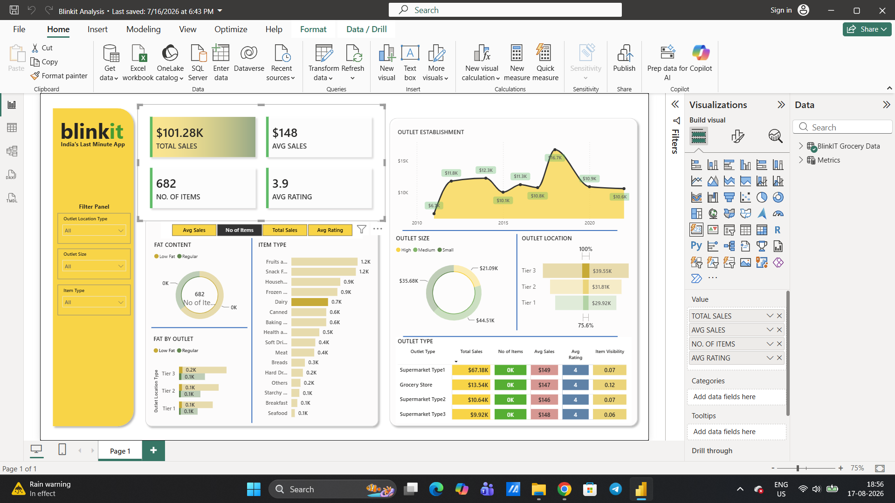

# Blinkit Sales Analytics Dashboard

An interactive **Power BI dashboard** built to analyze Blinkit's grocery sales performance, product characteristics, outlet performance, and customer ratings.

## 📊 Project Overview

This project analyzes Blinkit grocery sales data using **Microsoft Excel and Power BI**.

The dashboard provides an interactive view of sales performance across different product categories, outlet types, outlet sizes, outlet locations, fat-content categories, and outlet establishment years.

The objective was to transform raw grocery sales data into a clear and interactive business dashboard that can help identify sales patterns and compare outlet performance.

## 🎯 Business Objectives

* Analyze overall sales performance.
* Identify top-performing product categories.
* Compare sales across different outlet types and sizes.
* Analyze outlet performance across different location tiers.
* Compare products based on fat content.
* Analyze sales trends based on outlet establishment year.
* Monitor key performance indicators through an interactive dashboard.
* Allow users to filter the analysis based on different business dimensions.

## 🛠️ Tools & Technologies

* **Power BI** — Dashboard development and data visualization
* **Microsoft Excel** — Source dataset
* **Power Query** — Data preparation and transformation
* **DAX** — KPI and measure calculations

## 📈 Key Performance Indicators

The dashboard tracks four major KPIs:

| KPI             |   Value |
| --------------- | ------: |
| Total Sales     | 101.28K |
| Average Sales   |     148 |
| Number of Items |     682 |
| Average Rating  |     3.9 |

## 📊 Dashboard Features

### 1. Sales Performance

The dashboard provides an overview of total sales and average sales while showing how outlet performance changes across establishment years.

### 2. Product Analysis

Sales and item distribution are analyzed across multiple product categories, including:

* Fruits & Vegetables
* Snack Foods
* Household
* Frozen Foods
* Dairy
* Canned
* Baking Goods
* Health & Hygiene
* Soft Drinks
* Meat
* Breads
* Others
* Breakfast
* Seafood

### 3. Fat Content Analysis

Products are categorized based on their fat content to compare their contribution to overall item volume and outlet performance.

### 4. Outlet Analysis

The dashboard evaluates outlet performance based on:

* Outlet Type
* Outlet Size
* Outlet Location
* Outlet Location Tier
* Outlet Establishment Year

### 5. Interactive Filters

Users can dynamically filter the dashboard using:

* Outlet Location Type
* Outlet Size
* Item Type

These filters allow users to analyze specific outlet and product segments.

## 🔍 Key Insights

* The dataset contains **682 items** with total sales of approximately **101.28K**.
* Average sales are approximately **148**, while the overall average rating is **3.9**.
* Sales performance differs across outlet types and location tiers.
* Different product categories contribute differently to overall sales and item volume.
* Outlet establishment year shows variation in sales performance across different generations of outlets.
* The dashboard provides a consolidated view of product and outlet performance for easier comparison.

## 🖼️ Dashboard Preview



## 📁 Repository Structure

```text
Blinkit-Sales-Analytics/
│
├── Dataset/
│   └── BlinkIT Grocery Data.xlsx
│
├── Images/
│   ├── Dashboard_ss.png
│   ├── Avg Sales.png
│   ├── Items.png
│   ├── Sales.png
│   ├── background kpi.png
│   └── rating (1).png
│
├── Power BI/
│   └── Blinkit Analysis.pbix
│
└── README.md
```

## 🚀 How to Use

1. Download the `Blinkit Analysis.pbix` file from the **Power BI** folder.
2. Download the source dataset from the **Dataset** folder.
3. Open the `.pbix` file using **Power BI Desktop**.
4. If required, update the data source path to the downloaded Excel dataset.
5. Refresh the data.
6. Use the dashboard filters to explore different product and outlet segments.

## 💡 Skills Demonstrated

* Power BI Dashboard Development
* Data Visualization
* KPI Development
* Power Query
* DAX
* Exploratory Data Analysis
* Business-Oriented Data Analysis
* Interactive Reporting
* Microsoft Excel

## 👤 Author

**Manish Deora**

Data Analytics | Power BI | SQL | Python | Excel
